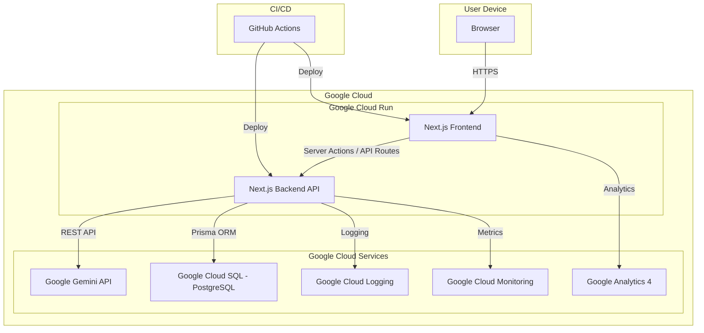

```mermaid
graph TD
    subgraph "User Device"
        A[Browser]
    end

    subgraph "Google Cloud"
        subgraph "Google Cloud Run"
            B[Next.js Frontend]
            C[Next.js Backend API]
        end

        subgraph "Google Cloud Services"
            D[Google Gemini API]
            E[Google Cloud SQL - PostgreSQL]
            F[Google Cloud Logging]
            G[Google Cloud Monitoring]
            H[Google Analytics 4]
        end
    end

    subgraph "CI/CD"
        I[GitHub Actions]
    end

    A -- HTTPS --> B
    B -- Server Actions / API Routes --> C
    C -- Prisma ORM --> E
    C -- REST API --> D
    C -- Logging --> F
    C -- Metrics --> G
    B -- Analytics --> H
    I -- Deploy --> B
    I -- Deploy --> C
```
