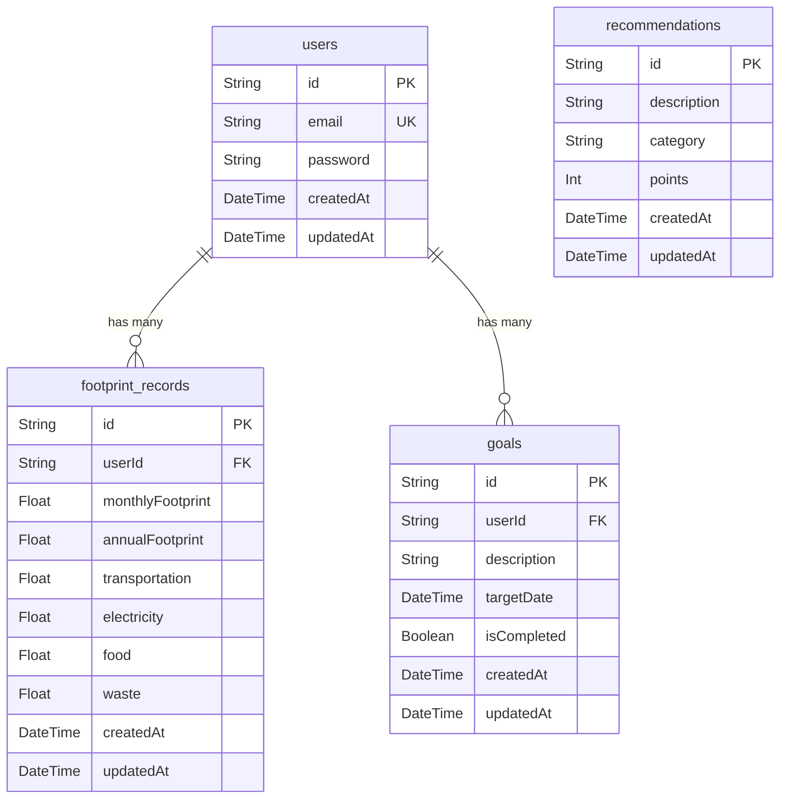

```mermaid
erDiagram
    users {
        String id PK
        String email UK
        String password
        DateTime createdAt
        DateTime updatedAt
    }

    footprint_records {
        String id PK
        String userId FK
        Float monthlyFootprint
        Float annualFootprint
        Float transportation
        Float electricity
        Float food
        Float waste
        DateTime createdAt
        DateTime updatedAt
    }

    goals {
        String id PK
        String userId FK
        String description
        DateTime targetDate
        Boolean isCompleted
        DateTime createdAt
        DateTime updatedAt
    }

    recommendations {
        String id PK
        String description
        String category
        Int points
        DateTime createdAt
        DateTime updatedAt
    }

    users ||--o{ footprint_records : "has many"
    users ||--o{ goals : "has many"
```
